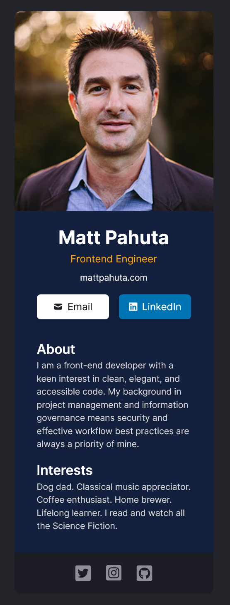

# Digital Business Card - A Scrimba FEWD Solo Project

This is my solution to the [Scrimba](https://scrimba.com/) solo project, Digital Business Card, part of the React basics module of the Frontend Career Path. 

## Table of contents

- [Overview](#overview)
  - [The requirements](#the-requirements)
  - [Screenshot](#screenshot)
  - [Links](#links)
- [My process](#my-process)
  - [Built with](#built-with)
- [Author](#author)

## Overview

### The requirements

- Built with React
- Built from scratch
- Follow design comp but customized with your own information
- Utilize separate components for: Info, About, Interests

### Screenshot

### Links

- [Scrimba Scrim](https://scrimba.com/scrim/co120400b8b16ed60b0895eda)
- [Live Site](https://heroic-babka-891e56.netlify.app/)

## My process

### Built with

- Semantic HTML5 markup
- CSS custom properties
- Flexbox
- CSS Grid
- Mobile-first workflow
- [React](https://reactjs.org/) - JS library

## Author

- Website - [Matt Pahuta](https://www.mattpahuta.com)
- Twitter - [@mattpahuta](https://www.twitter.com/MattPahuta)
- LinkedIn - [Matt Pahuta](www.linkedin.com/in/mattpahuta)